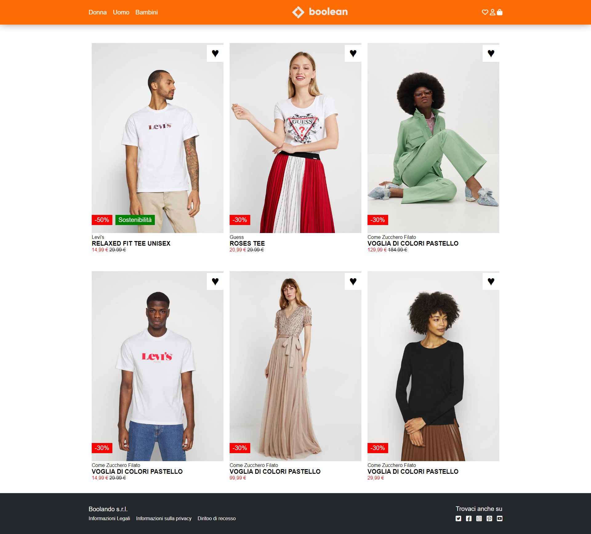

# Zalando - Replica web-page

**Initial commit**: 08/02/23

**Tecnologie**: HTML, CSS e :hover.

**Info**: 👗 Here is my replica of Zalando, one of the first projects created with Boolean.
In this exercise I used the property `:hover` to manage the image changes on mouse hover.

